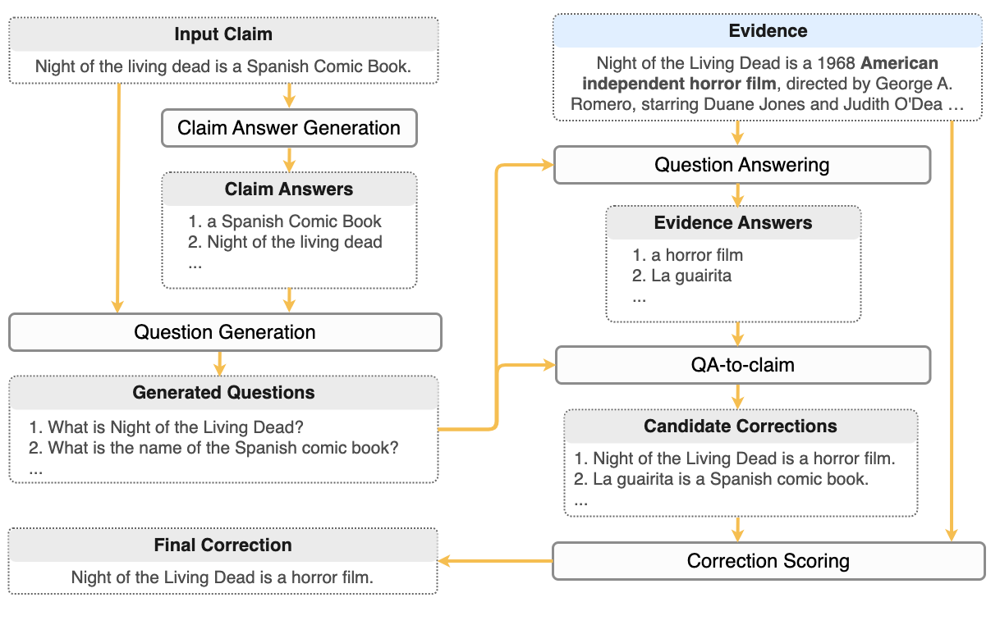

# Zero-shot Faithful Factual Error Correction (ACL 2023)


[Kung-Hsiang (Steeve) Huang](https://khuangaf.github.io/), [Hou Pong (Ken) Chan](https://www.fst.um.edu.mo/personal/hpchan/) and [Heng Ji](https://blender.cs.illinois.edu/hengji.html)

Paper link: [ACL](https://aclanthology.org/2023.acl-long.311/) 
## Abstract
Faithfully correcting factual errors is critical for maintaining the integrity of textual knowledge bases and preventing hallucinations in sequence-to-sequence models. Drawing on humans' ability to identify and correct factual errors, we present a zero-shot framework that formulates questions about input claims, looks for correct answers in the given evidence, and assesses the faithfulness of each correction based on its consistency with the evidence. Our zero-shot framework outperforms fully-supervised approaches, as demonstrated by experiments on the FEVER and SciFact datasets, where our outputs are shown to be more faithful. More importantly, the decomposability nature of our framework inherently provides interpretability. Additionally, to reveal the most suitable metrics for evaluating factual error corrections, we analyze the correlation between commonly used metrics with human judgments in terms of three different dimensions regarding intelligibility and faithfulness.



## Dependencies 

All the required packages are listed in `requirements.txt`. To install all the dependencies, run

```bash
conda create -n zerofec python=3.7
conda activate zerofec
pip install -r requirements.txt
```


## Data

The FEVER and SciFact datasets used in our experiments can be downloaded [here](https://drive.google.com/drive/folders/1PXZ-00vPrHAGc549ZOGC6W7s3bJH1lvo?usp=share_link). 

## Training
No training is needed as our framework corrects factual error is a zero-shot fashion. All individual components have been trained on the corresponding sub-task. Please download each component as follows:

* __Candidate Generation__: Download spacy models by running `python -m spacy download en_core_web_lg` and `python -m spacy download en_core_sci_md`.
* __Question Generation__: It's already on HuggingFace `Salesforce/mixqg-base`. No action needed.
* __Question Answering__: It's already on HuggingFace `allenai/unifiedqa-v2-t5-base-1251000`. No action needed.
* __QA-to-Claim__: Download the checkpoint folder from [here](https://drive.google.com/file/d/13ZEEkYR6HZgl5PaYc0oREjchODHmJ_kU/view?usp=share_link). Unzip it and move the directory such that it is at `zerofec/qa2claim`.
* __Correction Scoring__: Download the DocNLI model from [its repo](https://github.com/salesforce/DocNLI) such that the checkpoint is at `zerofec/docnli/DocNLI.pretrained.RoBERTA.model.pt`.

The checkpoints for the domain-adapted models can be found [here](https://drive.google.com/drive/folders/15JBbtHpcoaQWLRG8s_adx-0R2dhFYM4c?usp=sharing).


## Inference

The inference scripts for performing factual error correction is located under the `zerofec/scripts` directory. To run inference on the FEVER dataset, use the following command:

```bash
cd zerofec
mkdir output
mkdir output/fever
bash run.sh $OUTPUT_NAME
```

where `$OUTPUT_NAME` is the name of the experiment or output. The final output can be found at `output/fever/$OUTPUT_NAME/docnli_output.jsonl`. In this output file, we include all the intermediate outputs, including all the questions and answers generated and the scores, to demonstrate the interprebaility of our approach.


## Evaluation

Download the metrics by followng instructions in their corresponding repos:

* [QAFactEval](https://github.com/salesforce/QAFactEval)
* [BARTScore](https://github.com/neulab/BARTScore)
* [FactCC](https://github.com/salesforce/factCC)

The evaluation scripts are in the `evals` directory. All evaluation, except for QAFactEval, is in the script `evals.sh`. This is because QAFactEval has a different set of dependencies from metrics. For all other metrics, you can install corresponding dependencies in the `zerofec` virtual enviroment we created at the begging of this README. For QAFactEval, you need to create a new environment and install QAFactEval's dependencies in it.

```bash
cd evals
bash evals.sh $OUTPUT_PATH
```

where `$OUTPUT_PATH` is the path to the DocNLI output (it should look like `xxx/xxx/docnli_output.jsonl`). Following a similar procedure, you can evaluate our performance in QAFactEval using the `evals_qafactevals.sh` script.

## Direct Use

Example usage of ZeroFEC is shown below. 

```python
from types import SimpleNamespace
from zerofec.zerofec import ZeroFEC

model_args = {
    'qg_path': 'Salesforce/mixqg-base',
    'qa_model_path': 'allenai/unifiedqa-v2-t5-base-1251000',
    'qa_tokenizer_path': 't5-base',
    'entailment_model_path': 'PATH/TO/DocNLI.pretrained.RoBERTA.model.pt',
    'entailment_tokenizer_path':'roberta-large',
    'qa2s_tokenizer_path': 't5-base',
    'qa2s_model_path': 'PATH/TO/qa2claim-base/checkpoint-38000',
    'use_scispacy': False
}

model_args = SimpleNamespace(**model_args)

zerofec = ZeroFEC(model_args)

sample = {
  "input_claim": "Night of the Living Dead is a Spanish comic book."
  "evidence": "0 Night of the Living Dead is a 1968 American independent horror film , directed by George A. Romero ..."
}
corrected_claim = zerofec.correct(sample)
```
The `correct_claim` variable now contains `final_answer`, which is the corrected claim as well as all intermediate QA and QA outputs that provide interpretability.

Batch processing is supported with 

```
zerofec.batch_correct(samples)
```
where `samples` is a list of dictionary.

For additional information, please refer to `main.py`.

## Citation

If you find this work useful, please consider citing:

```bibtex
@inproceedings{huang2023zero,
  title     = "Zero-shot Faithful Factual Error Correction",
  author    = "Huang, Kung-Hsiang and Chan, Hou Pong and Ji, Heng",
  year = "2023",
  month= july,
  booktitle = "Proceedings of the 61th Annual Meeting of the Association for Computational Linguistics",
  publisher = "Association for Computational Linguistics",
}
```
